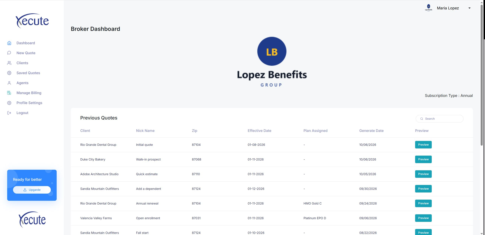
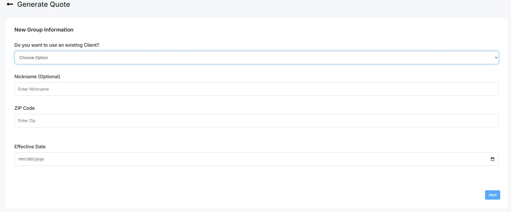
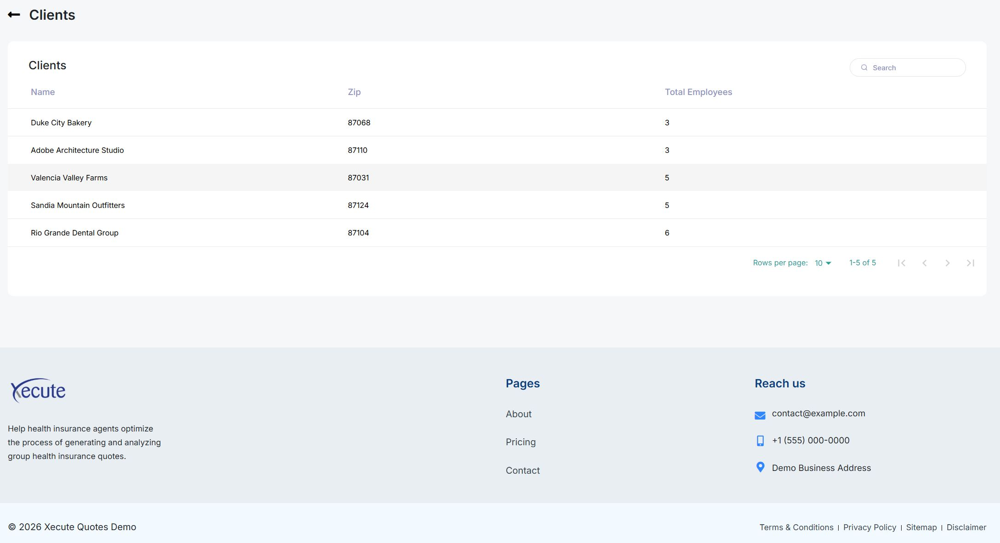
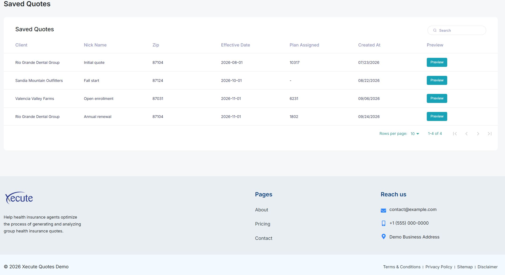
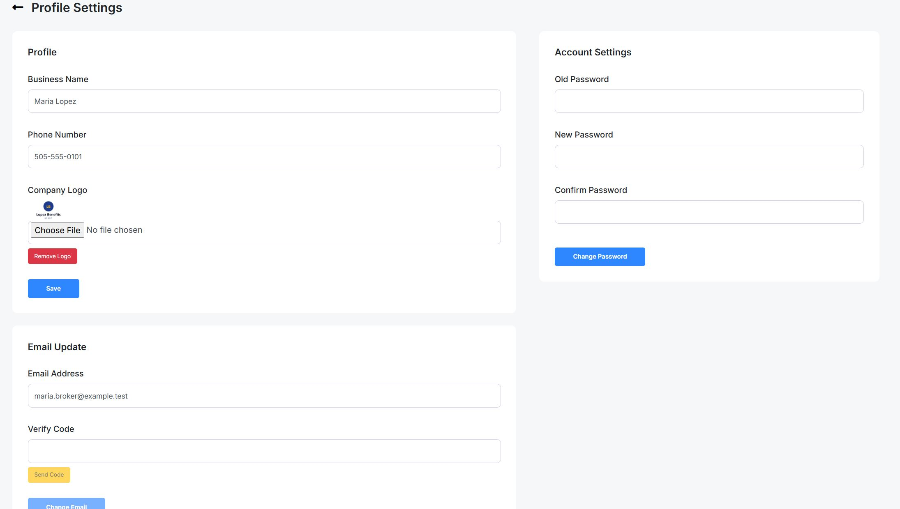
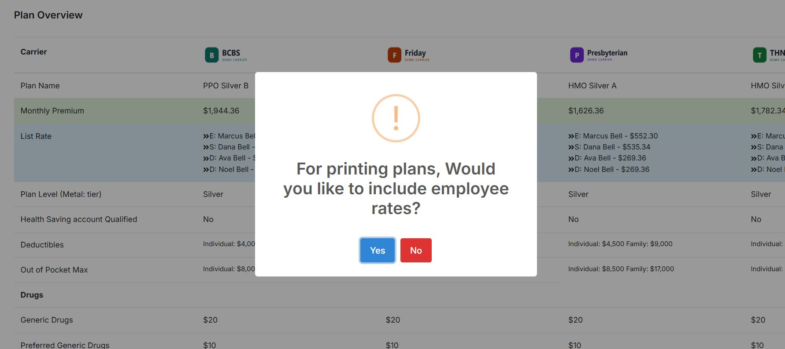
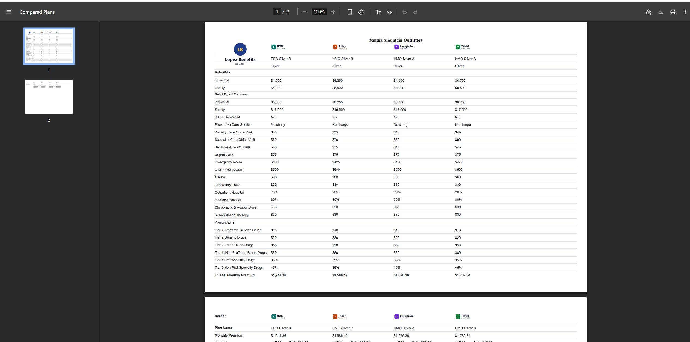
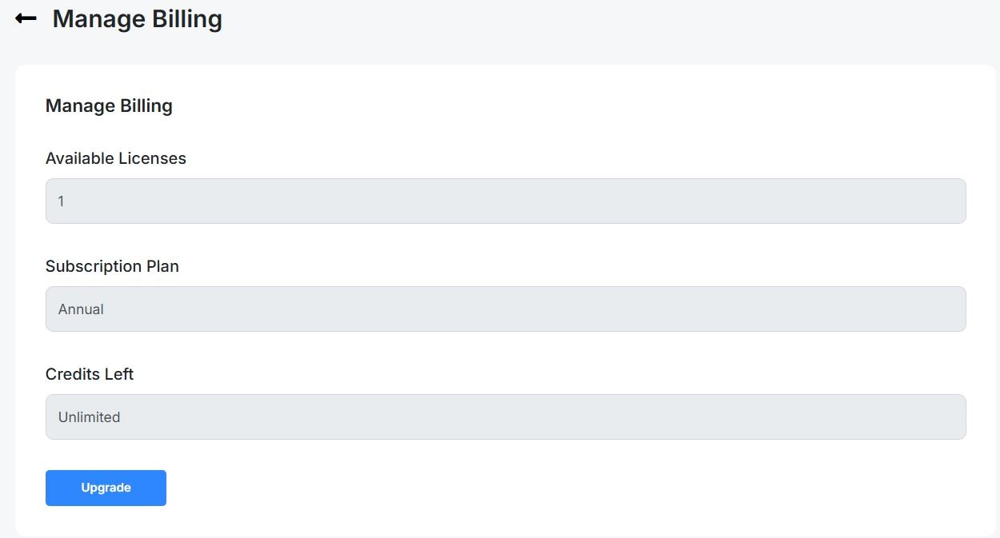

# Xecute Quotes


A modern **group health insurance quote management platform** built with **Laravel 7** and **React**.

The application enables insurance brokers to manage employer clients, maintain employee census data, generate insurance quotes, compare plans from multiple carriers, export professional PDF proposals, and manage subscriptions using realistic offline demo data.

---

## 🚀 Features

- 👥 Client & Employer Management
- 📋 Employee Census Management
- 💰 Health Insurance Quote Generation
- 📊 Multi-Carrier Plan Comparison
- 📄 PDF Quote & Proposal Generation
- 📁 Excel Import & Export
- 🔐 Authentication & Role-Based Authorization
- 💳 Billing, Credits & Subscription Management
- 🎭 Offline Demo Mode with Seeded Sample Data

---

## 📸 Screenshots

### Dashboard



---

### New Quote



---

### Clients



---

### Saved Quotes



---

### Profile Settings



---

### Print Confirmation



---

### PDF Preview



---

### Billing




## 🛠 Tech Stack

| Layer | Technology |
|-------|------------|
| **Backend** | PHP 7.2.5–7.4, Laravel 7, Laravel Passport, Laravel Excel, dompdf |
| **Frontend** | React 16 SPA, Laravel Mix 5, Webpack 4 |
| **Database** | MySQL / MariaDB |
| **Testing** | PHPUnit 8 (SQLite In-Memory) |

---

## 🚀 Quick Start

### Requirements

- PHP 7.4
- Composer
- MySQL or MariaDB
- PHP Extensions: `gd`, `zip`
- Node.js *(only if rebuilding the frontend)*

### Installation

```bash
composer install

cp .env.example .env

php artisan key:generate

php artisan passport:keys
```

Configure your `.env` file:

```env
DB_DATABASE=quote_demo
DB_USERNAME=your_username
DB_PASSWORD=your_password

DEMO_MODE=true
```

Run the database:

```bash
php artisan migrate:fresh --seed

php artisan serve
```

Frontend (optional):

```bash
npm install

npm run dev
```

Open:

http://127.0.0.1:8000

---

## 👤 Demo Accounts

Password for every account:

```text
Password123!
```

| Account | Role |
|----------|------|
| `admin@example.test` | Administrator |
| `maria.broker@example.test` | Annual Broker |
| `noah.free@example.test` | Free Broker |
| `priya.credits@example.test` | Broker with Purchased Credits |
| `new.broker@example.test` | New Broker |
| `agent.lee@example.test` | Licensed Employee |
| `agent.kim@example.test` | Licensed Employee |
| `agent.pending@example.test` | Pending Agent |
| `unverified.broker@example.test` | Email Not Verified |

The seeded demo database includes:

- 4 Insurance Carriers
- ~22,000 Generated Plan Prices
- 12 Employer Clients
- 43 Census Members
- 16 Quotes
- 8 Saved Quotes

---

## 🎭 Demo Mode

When `DEMO_MODE=true`:

- ✅ Card payments are simulated locally
- ✅ Emails are written to logs instead of being sent
- ✅ PDF links remain local
- ✅ New registrations are automatically verified

Production mode uses the real CardConnect, SMTP and SendGrid configuration from `.env`.

---

## ⚙ Configuration

Important environment variables:

| Variable | Description |
|----------|-------------|
| `DEMO_MODE` | Enables offline demo mode |
| `CARDCONNECT_*` | Production payment credentials |
| `MAIL_*` | Mail configuration |
| `SENDGRID_API_KEY` | SendGrid API Key |
| `GOOGLE_MAPS_API_KEY` | Optional Google Maps Browser Key |

---

## 📂 Project Structure

```text
app/
 ├── Http/
 ├── Models/
 ├── Services/
 │    ├── Authorization/
 │    ├── Payment/
 │    └── Quote/

config/
database/
resources/
routes/
tests/
public/
```

---

## 🔒 Authorization

Every protected API route passes through the custom **ownership middleware**.

Permissions include:

- Administrators can access every record.
- Brokers can only access their own clients and quotes.
- Licensed employees only access data assigned to them.
- Unauthorized resources return **404** to avoid leaking record existence.
- Role violations return **403 Unauthorized**.
- Every protected route is covered by automated authorization tests.

---

## 🧪 Testing

Run the PHPUnit suite:

```bash
php -d extension=sqlite3 -d extension=pdo_sqlite vendor/bin/phpunit
```

Current test coverage includes:

- Authorization
- Ownership Validation
- Protected Routes
- PDF Filename Security
- Token Protection
- Request Validation

---

## ⚠ Known Limitations

- Laravel 7 and PHP 7.4 are End-of-Life.
- Generated plan prices are sample data.
- Carrier logos are generated placeholders.
- Original "Xecute Quotes" branding has been preserved.

---

## 📄 License

This project is licensed under the **MIT License**.

See the [LICENSE](LICENSE) file for details.